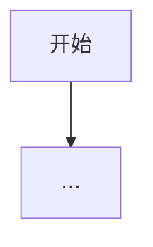

# 第 N 章 · 标题

## 漫画开场
（插图位：…）

## 概念
…

## 流程图或伪代码

```mermaid
flowchart TD
  A[开始] --> B[…]
```

## 照着打
```python
# …
```

## 小项目：名称
目标：…
完整代码：见 `code/chNN/…`
实验清单：见 `experiments/chNN.md`

## 高年级挑战题
<!-- high -->
…
